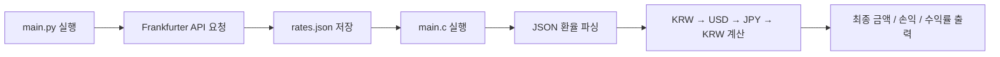

<h1 align="center">FX Loop Finder</h1>

<p align="center">
  <strong>KRW → USD → JPY → KRW 환전 루프에서 차익 가능성을 계산하는 C 콘솔 프로그램</strong>
</p>

<p align="center">
  
  
  
  
  
</p>

<br />

## Overview

`FX Loop Finder`는 원화(KRW), 달러(USD), 엔화(JPY)를 순서대로 환전했을 때 최종 금액이 시작 금액보다 커지는지 계산하는 환율 차익 분석 프로그램입니다.

사용자는 시작 금액과 수수료율을 입력하고, 프로그램은 `KRW → USD → JPY → KRW` 경로의 최종 금액, 예상 손익, 수익률을 계산합니다.  
환율 데이터는 Python 프로그램이 API에서 받아 `rates.json`에 저장하고, C 프로그램은 해당 JSON 파일을 읽어 분석을 수행합니다.

---

## Key Features

| 기능 | 설명 |
| --- | --- |
| 환전 루프 분석 | `KRW → USD → JPY → KRW` 경로의 최종 금액 계산 |
| 수수료 반영 | 각 환전 단계마다 사용자가 입력한 수수료율 적용 |
| 손익 계산 | 시작 금액 대비 예상 손익과 수익률 출력 |
| 환율 자동 업데이트 | Python 프로그램이 환율 API 값을 받아 `rates.json` 저장 |
| C 콘솔 UI | 메뉴 기반 콘솔 화면과 한글 함수/변수명 사용 |

---

## Tech Stack

| 구분 | 사용 기술 |
| --- | --- |
| Main Program | C |
| Rate Updater | Python 3 |
| Data Format | JSON |
| Compiler | GCC |
| API | Frankfurter API |
| Target Environment | Windows / PowerShell |

---

## Project Structure

```text
FX-Loop-Finder/
├─ main.c        # 콘솔 UI, JSON 읽기, 환율 파싱, 차익 계산
├─ main.py       # 환율 API 요청 및 rates.json 자동 저장
├─ rates.json    # C 프로그램이 읽는 환율 데이터
└─ README.md
```

---

## How It Works



---

## Getting Started

### 1. Requirements

아래 프로그램이 필요합니다.

```text
GCC
Python 3
```

Python 코드는 표준 라이브러리만 사용하므로 추가 패키지 설치는 필요하지 않습니다.

---

### 2. 환율 데이터 업데이트 실행

먼저 Python 프로그램을 실행해 `rates.json`을 업데이트합니다.

```powershell
python main.py
```

---

### 3. C 프로그램 컴파일 및 실행

새 터미널에서 C 프로그램을 컴파일한 뒤 실행합니다.

```powershell
gcc main.c -o FXLoopFinder.exe -Wall -Wextra -finput-charset=UTF-8 -fexec-charset=UTF-8
.\FXLoopFinder.exe
```

간단히 실행하려면 아래 명령어를 사용할 수도 있습니다.

```powershell
gcc main.c -o FXLoopFinder.exe && .\FXLoopFinder.exe
```

---

## Calculation Logic

기본 환전 경로는 다음과 같습니다.

```text
KRW → USD → JPY → KRW
```

환전할 때마다 수수료율이 한 번씩 적용됩니다.  
예를 들어 수수료율이 `0.1%`라면 각 단계마다 실제 환전되는 금액은 `99.9%`가 됩니다.

```text
USD = KRW × 원달러환율 × (1 - 수수료율)
JPY = USD × 달러엔환율 × (1 - 수수료율)
KRW = JPY × 엔원환율 × (1 - 수수료율)

손익 = 최종금액 - 시작금액
수익률 = 손익 / 시작금액 × 100
```

---

## Code Map

### C Program: `main.c`

| 함수 | 역할 | 담당 |
| --- | --- | --- |
| `입력버퍼정리()` | 입력 버퍼 정리 | 손태영 |
| `엔터대기()` | Enter 입력 대기 | 손태영 |
| `헤더출력()` | 프로그램 로고 출력 | 손태영 |
| `화면지우고헤더출력()` | 화면 초기화 후 헤더 출력 | 손태영 |
| `메뉴출력()` | 메뉴 화면 출력 | 손태영 |
| `환율표시()` | 현재 환율 출력 | 서정후 |
| `파일읽기()` | `rates.json` 파일 읽기 | 서정후 |
| `JSON환율파싱()` | JSON 문자열에서 환율 값 추출 | 서정후 |
| `환율업데이트()` | 파일에서 환율 업데이트 | 서정후 |
| `차익계산()` | 환전 루프 최종 금액 계산 | 서호현 |
| `수익률계산()` | 수익률 계산 | 서호현 |
| `결과표시()` | 분석 결과 출력 | 서호현 |
| `차익분석하기()` | 입력 처리 후 분석 실행 | 서호현 |
| `main()` | 전체 프로그램 실행 흐름 제어 | 손태영 |

---

## Main Variables

| 변수 | 설명 |
| --- | --- |
| `원달러환율` | KRW → USD 환율 |
| `달러엔환율` | USD → JPY 환율 |
| `엔원환율` | JPY → KRW 환율 |
| `메뉴선택` | 사용자가 선택한 메뉴 번호 |
| `시작금액` | 환전 시작 금액 |
| `수수료율` | 각 환전 단계의 수수료 비율 |
| `최종금액` | 계산된 최종 금액 |

---

## Notes

### 환율 데이터 관련

현재 `main.py`는 Frankfurter API를 사용합니다.  
이 API는 초 단위로 변하는 실시간 트레이딩 시세가 아니라, 최신 기준 환율 데이터를 제공합니다.

또한 `main.py`가 2초마다 `rates.json`을 다시 저장하더라도 API 원본 데이터가 바뀌지 않으면 환율 값은 그대로일 수 있습니다.

### 콘솔 한글 출력

Windows 콘솔에서 한글이 깨질 경우 아래 명령어로 UTF-8을 활성화하세요.

```powershell
chcp 65001
```

### 파일 구성

`main.c` 파일 하나로 콘솔 화면, 메뉴, 환율 읽기, JSON 파싱, 차익 계산을 모두 처리합니다.  
별도의 헤더 파일은 사용하지 않습니다.

---

## Summary

`FX Loop Finder`는 단순 환율 계산기가 아니라,  
Python 기반 환율 업데이트와 C 기반 콘솔 분석을 연결해 환전 루프의 차익 가능성을 확인하는 프로그램입니다.

작은 규모의 콘솔 프로젝트지만, 파일 입출력, JSON 파싱, 수수료 계산, 메뉴 UI, 외부 데이터 연동 구조를 함께 다룬다는 점에서 C 수행평가 프로젝트로 설명하기 좋은 구조를 가지고 있습니다.
